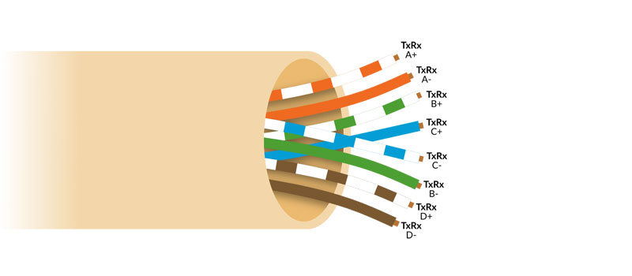
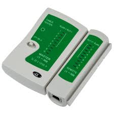
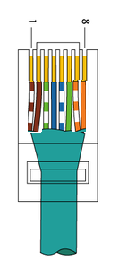

# 🧵 Case Study: Emergency Ethernet Cable Repair in a Medical Institution
🏷️ This case study documents a real incident where a damaged Ethernet cable threatened critical connectivity in a medical institution. It highlights diagnostic reasoning, improvisation under constraints, and lessons learned for structured cabling systems.

## 📑 Table of Contents
- [Incident Context](#-incident-context)
- [Ethernet Cable Structure](#-ethernet-cable-structure)
- [Symptoms Observed](#-symptoms-observed)
- [Layer 1 Approach](#-layer-1-approach)
- [Initial Hypothesis](#-initial-hypothesis)
- [Tools Used](#️-tools-used)
- [Diagnostic Process](#-diagnostic-process)
- [Solution Applied](#️-solution-applied)
- [Outcome](#-outcome)
- [Risk Management Considerations](#️-risk-management-considerations)
- [Why It Worked](#-why-it-worked)
- [Business Impact](#-business-impact)
- [Lessons Learned](#-lessons-learned)
- [Reflection](#-reflection)
- [Disclaimer](#️-disclaimer)
- [Summary](#-summary)
- [Keywords](#️-keywords)

<a href="#-table-of-contents">↑ Back to top</a>

---

## 📌 Incident Context
- Location: Medical institution
- Device: Critical PC with no wireless fallback or possibility to replace cable due to distance and safety concerns.
- Situation: The workstation was isolated and could not be re‑cabled immediately
- Impact: Connectivity was essential for medical operations — downtime was not an option

<a href="#-table-of-contents">↑ Back to top</a>

---

## 🧩 Ethernet Cable Structure
An Ethernet cable is made up of 8 individual copper wires, grouped into 4 twisted pairs.
Each pair has a specific role in carrying signals, and the twisting helps reduce interference:
- Orange Pair → Commonly used for transmit (TX) in Fast Ethernet
- Green Pair → Commonly used for receive (RX) in Fast Ethernet
- Blue Pair → Often used for voice or spare capacity in older standards
- Brown Pair → Often unused in 100 Mbps, but required in Gigabit Ethernet  
📌 Key idea:
- TX = Transmit → sends data out from your device
- RX = Receive → brings data into your device
- Gigabit Ethernet uses all 4 pairs, while Fast Ethernet (100 Mbps) only uses 2 pairs (orange + green).
- The other 2 pairs (blue + brown) are often reserved for PoE (Power over Ethernet), a technology that allows devices to receive electrical power through the same cable that carries data. Not used in this case.

<a href="#-table-of-contents">↑ Back to top</a>

---

## 🚨 Symptoms Observed
- The PC could not establish a network link.
- NIC tested functional, so the issue was cabling.
- Cable continuity testing revealed **one of the eight conductors was damaged**.

<a href="#-table-of-contents">↑ Back to top</a>

---

## 📡 Layer 1 Approach
When diagnosing no link / lack of connectivity, the first step is to consider Layer 1 (Physical Layer) of the OSI model:
- Check the medium: Is the cable intact, properly terminated, and compliant with standards?
- Verify continuity: Each conductor must be functional for the link to negotiate.
- Identify pair usage: Fast Ethernet (100 Mbps) relies on orange + green pairs for TX/RX. Gigabit Ethernet requires all four pairs.
- Assess environment: Physical damage, distance, or interference can all cause failures at Layer 1.
 📌 **In this case:**
- The cable tester confirmed the orange pair was damaged, preventing link negotiation.
- By repurposing the brown pair to act as TX, connectivity was restored.
- This demonstrates how a **Layer 1 diagnostic mindset** can resolve issues before escalating to higher layers (IP, applications).

<a href="#-table-of-contents">↑ Back to top</a>

---

## 🧠 Initial Hypothesis
Ethernet requires specific twisted pairs to send and receive data. These are known as TX (Transmit) and RX (Receive) pairs:
- TX (Transmit): The wires that carry data out from your computer or device.
- RX (Receive): The wires that carry data into your computer or device.
In 100BASE‑T (Fast Ethernet), the orange and green pairs are normally used for TX/RX. If one of these conductors is broken, the device can’t properly send or receive signals, so the link fails.

To confirm this suspicion, I used a cable tester to check continuity across all eight conductors. The tester results showed that one wire in the orange pair was damaged, validating the hypothesis that the link failure was caused by a physical Layer 1 issue.  

In this case, the cable was physically compromised, but replacement wasn’t immediately possible. That’s why I repurposed the unused blue and brown pairs to temporarily act as TX/RX — restoring connectivity until a certified cable could be installed.

<a href="#-table-of-contents">↑ Back to top</a>

---

## 🛠️ Tools Used
To diagnose and apply the workaround, I relied on standard cabling tools:
- Cable Tester → Verified continuity across all eight conductors and confirmed the orange pair was damaged.
- RJ45 Crimper → Re‑terminated the cable with the brown pair replacing the damaged orange.
- RJ45 Connectors → Used fresh connectors to ensure proper alignment and contact.
- Wire Stripper/Cutter → Prepared the cable ends for re‑termination.

<a href="#-table-of-contents">↑ Back to top</a>

---

## 🔍 Diagnostic Process
- Verified cable pinout and continuity.
- Identified the damaged pair (orange).
- Considered alternatives: repurposing unused pairs (blue/brown) to substitute for the broken conductors.

> Standard TIA-568B Layout: orange pair not working.

<a href="#-table-of-contents">↑ Back to top</a>

---

## 🛠️ Solution Applied
- Re‑terminated the cable using the brown pair in place of the damaged orange.
- Ensured proper alignment in the RJ45 connector.
- Tested link negotiation until connectivity was restored.
- Workaround broke TIA‑568A/B norms but was acceptable as a temporary emergency fix.

> Workaround Layout: cable ended up looking this way after applying the workaround, not respecting the TIA-568A or B norms, but working properly until we could solve the issue in the correct way.

> TX pair, in this workaround, ended up being the brown ones, in both ends of the cable; RX par was still green since it wasn't damaged.

<a href="#-table-of-contents">↑ Back to top</a>

---

## ✅ Outcome
- The PC regained full connectivity
- Operations continued without interruption
- The fix held until a certified replacement cable could be installed
- The solution surprised my boss, who doubted it was possible — but it worked reliably in the short term

> ⏱️ Diagnosis and workaround implementation took less than 30 minutes, minimizing downtime.

<a href="#-table-of-contents">↑ Back to top</a>

---

## 🛡️ Risk Management Considerations
- Improvisation was necessary in the moment, but it was documented and scheduled for permanent replacement.
- Standards compliance (TIA/EIA‑568) was temporarily broken, but business continuity took priority.
- This case highlights the importance of planning spare cabling routes and auditing structured cabling to reduce reliance on emergency fixes.

<a href="#-table-of-contents">↑ Back to top</a>

---

## 📚 Why It Worked
Fast Ethernet (100 Mbps) only requires two pairs (orange + green) for TX/RX. By repurposing the brown pair to substitute for the damaged orange, the link could still negotiate successfully.
Gigabit Ethernet, by contrast, requires all four pairs, so this workaround would not have been viable in a higher‑speed environment.

<a href="#-table-of-contents">↑ Back to top</a>

---

## 🏥 Business Impact:
- Restored critical medical connectivity, ensuring uninterrupted patient services.
- Prevented operational downtime in a sensitive environment where wireless fallback was not possible.
- Demonstrated ability to make fast, informed decisions under pressure, balancing technical improvisation with business continuity.
- Documented the workaround and flagged it for replacement, showing risk awareness and standards compliance.

<a href="#-table-of-contents">↑ Back to top</a>

---

## 🧭 Lessons Learned
- ✅ Ethernet pair substitution can restore connectivity in emergencies, but it breaks standards compliance
- ✅ Critical environments demand creative but responsible improvisation when downtime is unacceptable
- ✅ Documentation matters: recording the incident ensures others understand both the fix and its limitations
- ✅ Permanent replacement with certified cabling is always required for compliance and long‑term reliability
- ✅ Structured cabling audits and spare routes reduce reliance on emergency fixes.

<a href="#-table-of-contents">↑ Back to top</a>

---

## 🧭 Reflection
- This incident reinforced the importance of understanding cabling standards deeply. Improvisation saved the day, but long‑term reliability depends on compliance and planning.
- As an aspiring architect, I see these cases as proof that infrastructure design must account for both standards and real‑world constraints. Documenting them not only preserves technical lessons but also demonstrates how IT decisions directly impact organizational resilience.

<a href="#-table-of-contents">↑ Back to top</a>

---

## ⚠️ Disclaimer
**This workaround is not compliant with TIA/EIA or ISO cabling standards.**
It should only be used in emergencies when no other option is available.
Always replace with certified cabling as soon as possible.

<a href="#-table-of-contents">↑ Back to top</a>

---

## 🎯 Summary
This case study demonstrates how deep knowledge of Ethernet cabling can be applied under pressure to restore critical connectivity.
It highlights diagnostic reasoning, improvisation, and the importance of standards — all essential skills for infrastructure architects.

<a href="#-table-of-contents">↑ Back to top</a>

---

## 🔑 Keywords

`Ethernet cable repair` · `cabling case study` · `pair substitution` · `structured cabling` · `emergency connectivity` · `medical IT infrastructure` · `diagnostic workflow` · `improvisation under constraints` · `TIA‑568` · `Ethernet standards` · `PoE` · `incident response` · `business continuity`

<a href="#-table-of-contents">↑ Back to top</a>

---

✍️ Authored by **Franco [francoameri]**
📜 Licensed under [CC BY 4.0](https://github.com/francoameri/francoameri/blob/main/LICENSE.md)
Please credit the original author when sharing or adapting this work.
