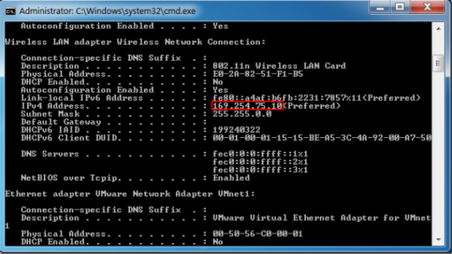
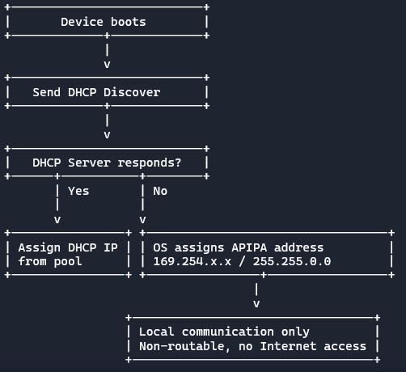

🔎 Context
In a previous role, I encountered recurring connectivity issues in a /24 network. Several production devices were unexpectedly receiving APIPA addresses (169.254.x.x), which immediately signaled DHCP-related problems. Using IPAM (IP Address Management) tools, I confirmed that the DHCP pool was exhausted.

⚠️ Problem
- DHCP lease times were configured too long, preventing IPs from being released quickly enough.
- As a result, new devices joining the network couldn’t obtain valid addresses and fell back to APIPA.
- The /24 subnet (254 usable IPs) was insufficient for the growing environment.

  
🛠️ Solution
- Adjusted DHCP lease times to better match device usage patterns.
- Migrated to a /23 subnet, expanding the pool to 510 usable IPs.
- Monitored IP utilization with IPAM to ensure proactive capacity planning.
  
📈 Outcome
- Eliminated recurring APIPA assignments in production.
- Improved reliability and scalability of the network.
- Strengthened monitoring practices to prevent future IP exhaustion.

📖 Theory: What is APIPA?
- Definition: APIPA (Automatic Private IP Addressing) is a feature embedded in operating systems that automatically assigns an IP address when a device cannot reach a DHCP server.
- Range & Subnet: APIPA uses the reserved block 169.254.0.1 – 169.254.255.254 with a 255.255.0.0 subnet mask.
- Purpose: Ensures local communication between devices on the same subnet when DHCP is unavailable.
- Limitations: APIPA addresses are non-routable—they cannot access the Internet or communicate outside the local link.
- Diagnostic Value: The presence of APIPA often indicates DHCP failure, NIC or TCP/IP stack issues, or IP pool exhaustion from DHCP.

📖 Theory: Subnetting & VLSM
- Subnetting: The process of dividing a larger IP network into smaller, more manageable segments (subnets). It helps optimize address usage, improve performance, and enhance security.
- VLSM (Variable Length Subnet Masking): Allows using different subnet masks within the same network, making IP allocation more efficient by tailoring subnet sizes to actual needs.
- /24 Network:
- Subnet mask: 255.255.255.0
- Usable hosts: 254 (2^8 – 2 for network & broadcast)
- Typical for small LANs.
- /23 Network:
- Subnet mask: 255.255.254.0
- Usable hosts: 510 (2^9 – 2)
- Doubles the available IPs compared to /24, useful when a /24 runs out of addresses.

/24 Network (255.255.255.0)
---------------------------------
Network: 192.168.1.0
Range:   192.168.1.1 – 192.168.1.254
Hosts:   254 usable

/23 Network (255.255.254.0)
---------------------------------
Network: 192.168.0.0
Range:   192.168.0.1 – 192.168.1.254
Hosts:   510 usable
  
💡 Lessons Learned
- APIPA isn’t just an annoyance—it’s a diagnostic signal that DHCP or IP allocation needs attention.
- Proper lease time configuration is critical in dynamic environments.
- Subnet sizing must evolve with infrastructure growth.

---

🌟 Impact Statement
By reconfiguring DHCP lease times and expanding the subnet from /24 to /23, I eliminated recurring APIPA assignments, improved network reliability, and established proactive monitoring practices. This reduced troubleshooting overhead, ensured scalability for future growth, and demonstrated architect‑level foresight in capacity planning.
