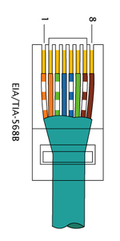

# 🧵 Case Study: Emergency Ethernet Cable Repair in a Medical Institution
🏷️ This case study documents a real incident where a damaged Ethernet cable threatened critical connectivity in a medical institution. It highlights diagnostic reasoning, improvisation under constraints, and lessons learned for structured cabling systems.

## 📌 Incident Context
- Location: Medical institution
- Device: Critical PC with no wireless fallback or possibility to replace cable due to distance and safety concerns.
- Situation: The workstation was isolated and could not be re‑cabled immediately
- Impact: Connectivity was essential for medical operations — downtime was not an option

---

## 🧩 Ethernet Cable Structure
An Ethernet cable is made up of 8 individual copper wires, grouped into 4 twisted pairs.
Each pair has a specific role in carrying signals, and the twisting helps reduce interference:
- Orange Pair → Commonly used for transmit (TX) in Fast Ethernet
- Green Pair → Commonly used for receive (RX) in Fast Ethernet
- Blue Pair → Often used for voice or spare capacity in older standards
- Brown Pair → Often unused in 100 Mbps, but required in Gigabit Ethernet
📌 Key idea:
- TX = Transmit → sends data out from your device
- RX = Receive → brings data into your device
- Gigabit Ethernet uses all 4 pairs, while Fast Ethernet (100 Mbps) only uses 2 pairs (orange + green).
- The other 2 pairs (blue + brown) are often reserved for PoE (Power over Ethernet), a technology that allows devices to receive electrical power through the same cable that carries data. Not used in this case.

---

## 🚨 Symptoms Observed
- The PC could not establish a network link.
- NIC tested functional, so the issue was cabling.
- Cable continuity testing revealed **one of the eight conductors was damaged**.

---

## 🧠 Initial Hypothesis
Ethernet requires specific twisted pairs to send and receive data. These are known as TX (Transmit) and RX (Receive) pairs:
- TX (Transmit): The wires that carry data out from your computer or device.
- RX (Receive): The wires that carry data into your computer or device.
In 100BASE‑T (Fast Ethernet), the orange and green pairs are normally used for TX/RX. If one of these conductors is broken, the device can’t properly send or receive signals, so the link fails.
In this case, the cable was physically compromised, but replacement wasn’t immediately possible. That’s why I repurposed the unused blue and brown pairs to temporarily act as TX/RX — restoring connectivity until a certified cable could be installed.

---

## 🔍 Diagnostic Process
- Verified cable pinout and continuity.
- Identified the damaged pair (orange).
- Considered alternatives: repurposing unused pairs (blue/brown) to substitute for the broken conductors.

> Failing cable layout: orange pair not working.

---

## 🛠️ Solution Applied
- Re‑terminated the cable using the brown pair in place of the damaged orange.
- Ensured proper alignment in the RJ45 connector.
- Tested link negotiation until connectivity was restored.
- Workaround broke TIA‑568A/B norms but was acceptable as a temporary emergency fix.

> Cable ended up looking this way after applying the workaround, not respecting the TIA-568A or B norms, but working properly until we could solve the issue in the correct way.

> TX pair, in this workaround, ended up being the brown ones, in both ends of the cable; RX par was still green since it wasn't damaged.

---

## ✅ Outcome
- The PC regained full connectivity
- Operations continued without interruption
- The fix held until a certified replacement cable could be installed
- The solution surprised my boss, who doubted it was possible — but it worked reliably in the short term

---

## 🏥 Business Impact:
-Restored critical medical connectivity, preventing disruption in patient care.

---

## 🧭 Lessons Learned
- ✅ Ethernet pair substitution can restore connectivity in emergencies, but it breaks standards compliance
- ✅ Critical environments demand creative but responsible improvisation when downtime is unacceptable
- ✅ Documentation matters: recording the incident ensures others understand both the fix and its limitations
- ✅ Permanent replacement with certified cabling is always required for compliance and long‑term reliability

---

## ⚠️ Disclaimer
**This workaround is not compliant with TIA/EIA or ISO cabling standards.**
It should only be used in emergencies when no other option is available.
Always replace with certified cabling as soon as possible.

---

## 🎯 Summary
This case study demonstrates how deep knowledge of Ethernet cabling can be applied under pressure to restore critical connectivity.
It highlights diagnostic reasoning, improvisation, and the importance of standards — all essential skills for infrastructure architects.

---

## 🗝️ Keywords
Ethernet cable repair, cabling case study, pair substitution, structured cabling, emergency connectivity, medical IT infrastructure, diagnostic workflow, improvisation under constraints, TIA‑568, Ethernet standards, PoE, critical IT environments.
