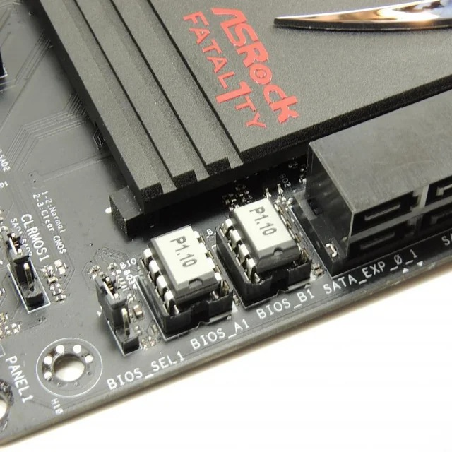
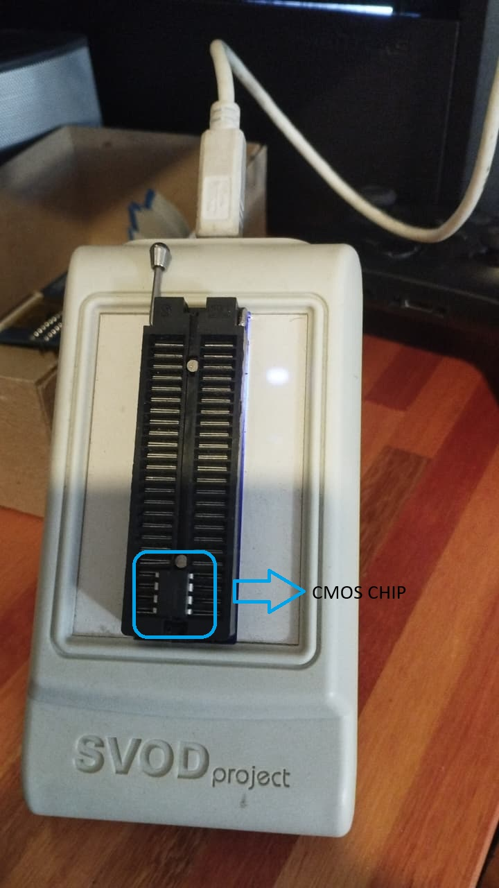

# Case Study: Reviving a Bricked BIOS with SVOD3 Programmer

## 📌 Overview
This case study documents the troubleshooting and recovery process of a desktop PC with a bricked BIOS.  
The system showed no POST, no beeps, and appeared to have a dead motherboard.  
Using an SVOD3 Programmer, the BIOS firmware was successfully restored.

---

## 🛑 Problem Statement
- PC failed to boot: no video, no POST, no beeps.
- Standard troubleshooting steps (RAM swap, PSU test, CMOS battery removal, spare CPU) did not resolve the issue.
- Diagnosis pointed to a corrupted BIOS firmware.

---

💾 BIOS/UEFI & CMOS Sizes
- BIOS/UEFI firmware is stored on a non-volatile memory chip (often SPI flash).
- Typical sizes range from 1 MB to 32 MB depending on motherboard generation and vendor.
- CMOS refers to a small memory area powered by the battery, storing configuration settings (boot order, time/date, hardware parameters).
- CMOS size is much smaller — usually 64 KB or less — compared to BIOS/UEFI flash storage.
- Key distinction:
- BIOS/UEFI = firmware image (large, stored in flash).
- CMOS = settings data (tiny, volatile, battery-backed).

---

## 🔧 Tools & Materials
- **SVOD3 Programmer** (external programmer for CMOS chips)
- CMOS chip from the affected motherboard
- Correct BIOS firmware (downloaded from vendor support site)
- Basic electronics toolkit (chip removal tools, anti-static setup)

---

## 🛠️ Recovery Process
1. **Identify the CMOS chip** on the motherboard.
2. **Remove the chip** carefully using proper tools.
3. **Load the firmware**: Downloaded the correct BIOS/UEFI image from the manufacturer.
4. **Flash the chip** using the SVOD3 Programmer.

5. **Reinstall the chip** back onto the motherboard.
6. **Test the system**: Power on → successful POST → system restored.

---

## ✅ Outcome
- The PC booted successfully after reflashing the BIOS.
- Demonstrated that a “dead” motherboard can sometimes be revived with the right tools and methodical troubleshooting.

---

## 💡 Lessons Learned
- **Layered troubleshooting** is critical: exhaust standard checks before moving to advanced recovery.
- **Firmware vs hardware distinction**: CMOS chip is hardware, BIOS/UEFI is firmware stored on it.
- **Resilience mindset**: Persistence and creativity are as important as technical skill.

---

## 📂 Applications
- Infrastructure engineers can apply the same layered troubleshooting mindset to complex systems (cloud clusters, virtualization platforms, network outages).
- Highlights the importance of redundancy and recovery planning in architecture design.

---

## 🤝 Discussion
Have you ever revived hardware or infrastructure against the odds?  
Share your experiences or improvements to this workflow!
