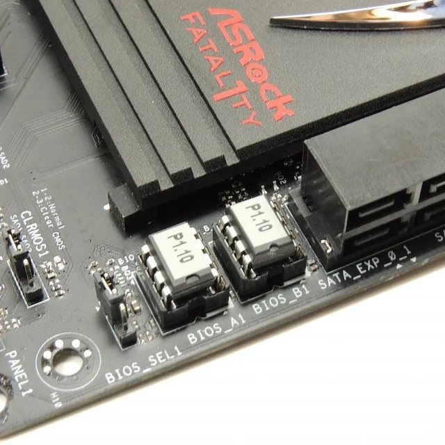
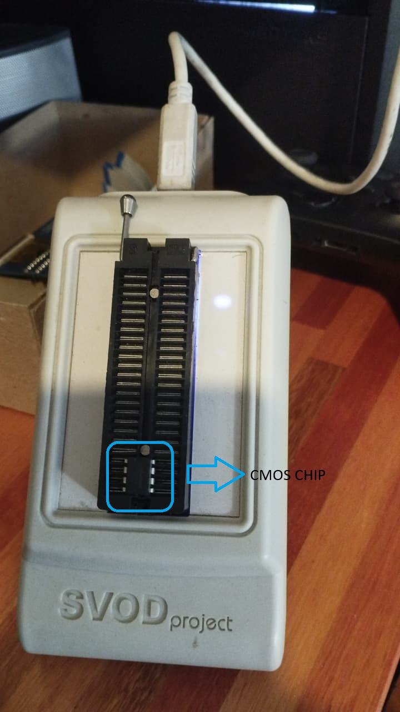
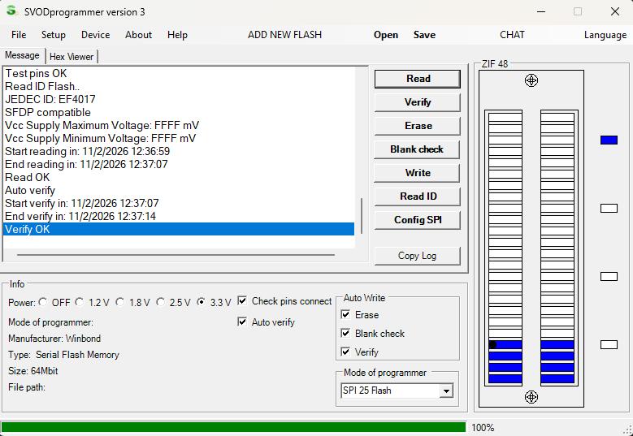

# Case Study: Reviving a Bricked BIOS with SVOD3 Programmer

## 📌 Overview
This case study documents the troubleshooting and recovery process of a desktop PC with a bricked BIOS.  
The system showed no POST, no beeps, and appeared to have a dead motherboard.  
Using an SVOD3 Programmer, the BIOS firmware was successfully restored.

---

## 👤 Role & Responsibility
As an independent Infrastructure Technician, I led advanced hardware recovery beyond standard troubleshooting. This case demonstrates my ability to move past conventional fixes and apply specialized tools to restore critical systems

---

## 🛑 Problem Statement
- PC failed to boot: no video, no POST, no beeps.
- Standard troubleshooting steps (RAM swap, PSU test, CMOS battery removal, spare CPU) did not resolve the issue.
- Diagnosis pointed to a corrupted BIOS firmware.

---

## 💾 BIOS/UEFI & CMOS Sizes
- BIOS/UEFI firmware is stored on a non-volatile memory chip (often SPI flash).
- Typical sizes range from 1 MB to 32 MB depending on motherboard generation and vendor.
- CMOS refers to a small memory area powered by the battery, storing configuration settings (boot order, time/date, hardware parameters).
- CMOS size is much smaller — usually 64 KB or less — compared to BIOS/UEFI flash storage.
- Key distinction:
- BIOS/UEFI = firmware image (large, stored in flash).
- CMOS = settings data (tiny, volatile, battery-backed).

---

## 📖 Applied Theory
Understanding that BIOS firmware resides in SPI flash—not the CMOS settings—was key to identifying the real failure point. This distinction guided the recovery process and prevented wasted effort on configuration resets.

---

## 🔧 Tools & Materials
- **SVOD3 Programmer** (external programmer for CMOS chips)
- CMOS chip from the affected motherboard
- Correct BIOS firmware (downloaded from vendor support site)
- Basic electronics toolkit (chip removal tools, anti-static setup)

---

## 🛠️ Recovery Process
1. **Identify the CMOS chip** on the motherboard.
2. **Remove the chip** carefully using proper tools.
3. **Load the firmware**: Downloaded the correct BIOS/UEFI image from the manufacturer.
4. **Flash the chip** using the SVOD3 Programmer.

5. **Reinstall the chip** back onto the motherboard.
6. **Test the system**: Power on → successful POST → system restored.

---

## 🧩 Alternatives Considered
Other recovery paths included vendor RMA, hot‑flashing with a working board, or replacing the motherboard entirely. Choosing the SVOD3 programmer ensured direct control, faster resolution, and preserved the original hardware.

---

## ✅ Outcome
- The PC booted successfully after reflashing the BIOS.
- Demonstrated that a “dead” motherboard can sometimes be revived with the right tools and methodical troubleshooting.

---

## 📊 Impact & Quantification
Reviving the motherboard avoided unnecessary replacement costs and downtime. By restoring functionality, I saved the equivalent of a full hardware swap and reduced turnaround time from days to hours.

---

## 💡 Lessons Learned
- Layered troubleshooting prevents premature hardware replacement.
- Firmware recovery parallels infrastructure recovery: persistence applies across systems.
- Documenting recovery builds credibility and reproducibility.

---

## 📂 Applications
- Infrastructure engineers can apply the same layered troubleshooting mindset to complex systems (cloud clusters, virtualization platforms, network outages).
- Highlights the importance of redundancy and recovery planning in architecture design.

---

## 🚀 Impact Statement
By methodically diagnosing a bricked BIOS and restoring it with an SVOD3 Programmer, I revived a motherboard that appeared irrecoverable. This not only saved hardware from replacement but also reinforced the value of layered troubleshooting, firmware knowledge, and resilience in infrastructure work. The case demonstrates architect‑level foresight: treating failures as opportunities to design recovery strategies that scale from hardware to enterprise systems.

---

## 🔑 Keywords

> BIOS Recovery, UEFI Firmware, CMOS Settings, SPI Flash Programming, SVOD3 Programmer, Hardware Troubleshooting, Firmware Restoration, Infrastructure Technician Case Study, Advanced Diagnostics, Motherboard Repair, Risk Mitigation, Cost Avoidance, Layered Troubleshooting, Resilience in Infrastructure
