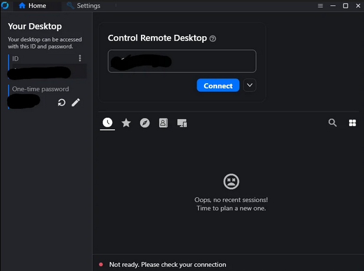
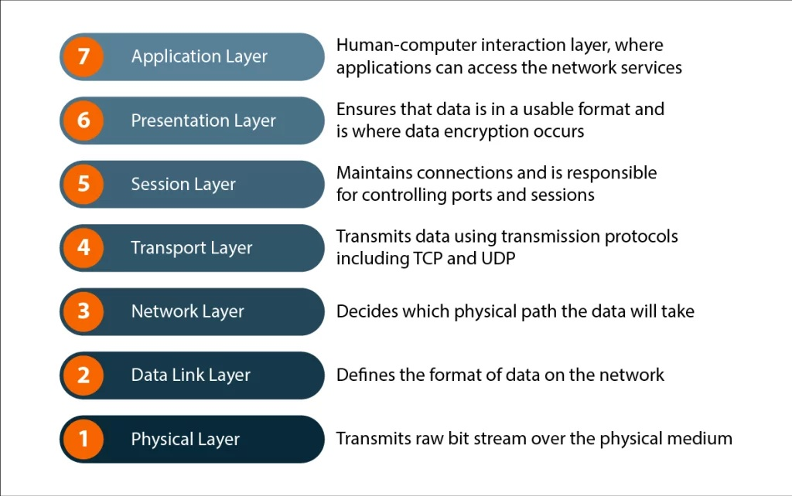

📂 Case Study: RustDesk Connectivity Failure in Production
🏭 Context
- Environment: Local SMB, production team using RustDesk for remote connections.
- Criticality: RustDesk was essential for daily operations; outage impacted all PCs simultaneously.
- Infrastructure: Router configured with 3 ISPs in high availability (HA).

⚠️ Symptoms
- RustDesk offline across all production PCs.
- Application update did not resolve the issue.
- RustDesk servers confirmed online.
- No similar cases documented in forums or community channels.

🔍 Initial Hypotheses (Layer 7 – Application)
- Software malfunction → disproven after update.
- Server outage → disproven after checks.
- Known bug or precedent → none found.

🌐 Refined Hypothesis (Layer 3 – Network)
- Suspected WAN routing issue tied to one ISP.
- Approach: isolate ISPs one by one while maintaining business continuity.

✅ Resolution
- Disconnected ISPs sequentially.
- Identified one ISP with faulty routing to RustDesk servers.
- Remaining ISPs in HA took over traffic.
- RustDesk service restored immediately.

📘 Lessons Learned
- The OSI Model is not just theoretical; it is a practical troubleshooting framework.
- Moving systematically through layers helps isolate non-obvious issues.
- ISP routing problems can mimic application-level failures.
- High availability with multiple ISPs provides resilience, but also requires careful diagnosis when one path fails.

🚀 Takeaway
This case demonstrates how structured troubleshooting, guided by the OSI model, can resolve complex connectivity issues. Documenting these incidents builds a portfolio of real-world problem-solving strategies that highlight both technical skill and systematic thinking.

