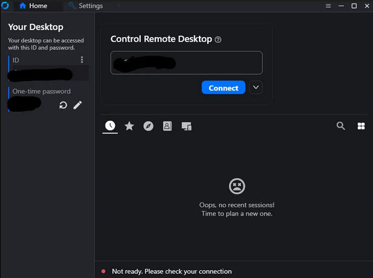
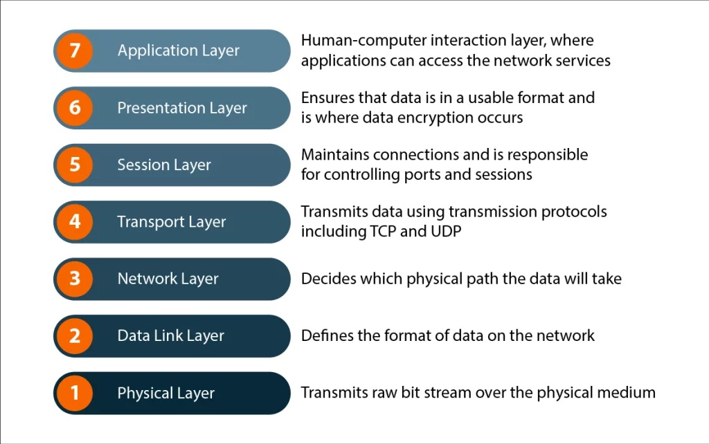

# 📂 Case Study: RustDesk Connectivity Failure in Production
## 🏭 Context
- Environment: Local SMB, production team using RustDesk for remote connections.
- Criticality: RustDesk was essential for daily operations; outage impacted all PCs simultaneously.
- Infrastructure: Router configured with 3 ISPs in high availability (HA).

---

## 👤 Role & Responsibility
As Infrastructure Engineer, I was responsible for diagnosing and restoring critical remote connectivity in a production SMB environment. My role required balancing business continuity with systematic troubleshooting.

---

## ⚠️ Symptoms
- RustDesk offline across all production PCs.
- Application update did not resolve the issue.
- RustDesk servers confirmed online.
- No similar cases documented in forums or community channels.

---

## 🔍 Initial Hypotheses (Layer 7 – Application)
- Software malfunction → disproven after update.
- Server outage → disproven after checks.
- Known bug or precedent → none found.

---

## 📖 Applied Theory
The OSI Model guided the troubleshooting process:
- Layer 7 (Application): Ruled out software malfunction and server outage.
- Layer 3 (Network): Identified faulty ISP routing as the root cause.
This demonstrates how theoretical frameworks translate into practical diagnostics.

---

## 🌐 Refined Hypothesis (Layer 3 – Network)
- Suspected WAN routing issue tied to one ISP.
- Approach: isolate ISPs one by one while maintaining business continuity.

---

## 🧩 Alternatives Considered
Other potential paths included:
- Switching entirely to a backup remote access tool.
- Escalating to RustDesk support for deeper investigation.
- Replacing HA routing with a single ISP temporarily.
Choosing ISP isolation preserved continuity and avoided unnecessary complexity.

---

## ✅ Resolution
- Disconnected ISPs sequentially.
- Identified one ISP with faulty routing to RustDesk servers.
- Remaining ISPs in HA took over traffic.
- RustDesk service restored immediately.

---

## 📊 Impact & Quantification
- Restored RustDesk connectivity across all production PCs within hours.
- Prevented extended downtime that would have halted daily operations.
- Demonstrated ability to maintain business continuity while troubleshooting ISP routing issues.

---

## 📘 Lessons Learned
- The OSI Model is a practical roadmap, not just theory.
- High availability adds resilience but complicates diagnosis when one path fails.
- Documenting incidents builds a reusable knowledge base for future outages.

---

## 🚀 Takeaway
By systematically applying the OSI model and isolating ISP paths, I restored RustDesk connectivity across production PCs. This reduced downtime, preserved business continuity, and demonstrated architect‑level foresight in troubleshooting complex multi‑ISP environments.

---

## 🔑 Keywords

> High Availability, Fault Tolerance, Mesh Topology, Proxmox Virtualization, TrueNAS Storage, OpenWRT Networking, Network Architecture & Design, Project Management (Jira), Cost-Conscious Infrastructure, Scalability & Security Planning, Change Management, SMB Infrastructure Case Study, Enterprise-Grade Resilience, Risk Analysis & Mitigation
